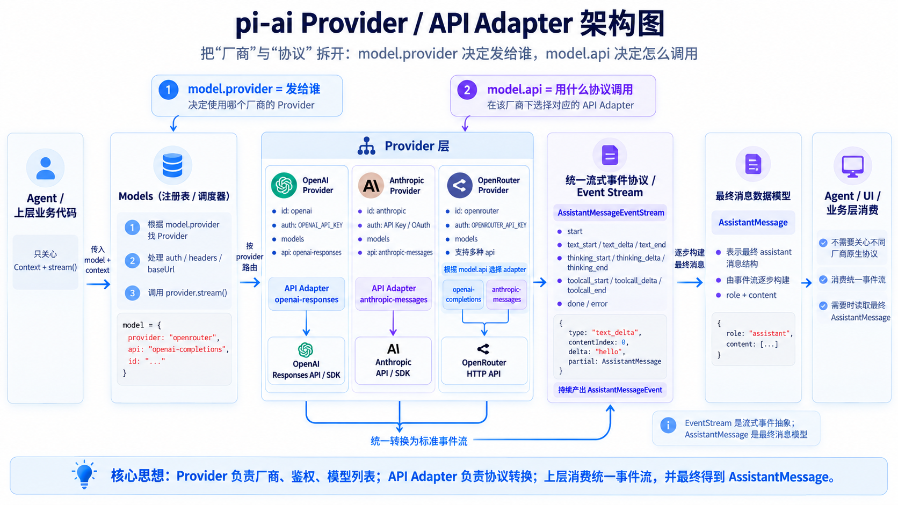

# 第二讲：从 120 行 Demo 到 Agent 架构

Hello, boys and girls.

上一讲，我们没有使用 Agent 框架，也没有使用模型 SDK，只用一个 TypeScript 文件跑通了最小 ReAct Loop：把消息交给模型，模型通过 `tool_use` 请求执行命令，宿主程序完成执行，再把 `tool_result` 放回消息历史。

那 120 行代码很短，也确实可以工作。既然如此，为什么还要重构？

因为接下来会同时发生几种变化：更换模型协议、增加工具、把命令行换成 TUI 或桌面端。它们继续挤在一个文件里，每增加一种能力，都要重新理解整个程序。

这一讲，我们不增加更强的工具，而是给上一讲的最小 Agent 建立一副可以继续生长的骨架：Foundation 契约、`Agent` 类、可替换的 Provider，以及 Foundation、Agent、Coding、CLI 四层结构。

我们主要回答五个问题：

1. 为什么一段只有 120 行、已经能运行的代码仍然需要重构？
2. Message、Model 和 Tool 为什么应该成为 Foundation 契约？
3. `Agent` 类应该管理什么，又不应该知道什么？
4. Provider 如何隔离不同模型厂商的协议？
5. Foundation、Agent、Coding、CLI 四层如何协作？

## 从切换模型开始

第一讲的 Agent 直接调用 Anthropic Messages API：

```ts
const response = await fetch(`${baseURL}/v1/messages`, {
  headers: {
    "x-api-key": apiKey,
    "anthropic-version": "2023-06-01",
  },
  body: JSON.stringify({
    model,
    messages,
    tools: [bashTool],
  }),
})
```

如果使用 DeepSeek 提供的 [Anthropic 兼容接口](https://api-docs.deepseek.com/zh-cn/guides/anthropic_api/)，只要修改地址、API Key 和模型名称，同一份代码仍然能够工作：

```text
ANTHROPIC_BASE_URL=https://api.deepseek.com/anthropic
ANTHROPIC_API_KEY=your-deepseek-api-key
ANTHROPIC_MODEL=deepseek-v4-flash
```

这是因为我们更换了模型服务，但没有更换通信协议。程序发送的仍然是 Anthropic Messages，收到的仍然是 `text`、`tool_use` 和 `tool_result` Content Block。

但如果下一个模型只支持 OpenAI Chat Completions，协议就变了：

| | Anthropic Messages | OpenAI Chat Completions |
|---|---|---|
| 工具请求 | `tool_use` | `tool_calls` |
| 参数 | `input` 对象 | `function.arguments` 字符串 |
| 工具结果 | User Message 中的 `tool_result` | `role: "tool"` |

两者表达的是同一个意图，但字段和消息结构不同。ReAct Loop 只需要知道“模型请求了什么工具”，不应该同时理解每家 API 的字段。

所以我们需要在 Agent 和模型 API 之间建立一层稳定的语言。

## 120 行代码中藏着哪些变化

回看第一讲的 `agent.ts`，里面至少有五种不同职责：

```text
Message 类型        描述消息和 Content Block
callModel()         组织 HTTP 请求并解析模型响应
runAgent()          维护消息历史并运行 ReAct Loop
executeTool()       查找和执行工具
命令行入口           读取参数并打印最终结果
```

它们现在挤在一起，是因为第一个版本只有一个模型、一个工具和一个入口。但它们变化的原因并不相同：

| 发生的变化 | 真正需要变化的部分 |
|---|---|
| Anthropic 换成 OpenAI | Provider |
| 增加 `read_file` | Coding Tool |
| 修改最大循环次数 | Agent |
| 命令行换成 TUI | CLI |
| 增加图片消息 | Foundation Message 与 Provider |

重构并不是把一个文件机械地拆成很多文件。真正的目标是：

> 让由同一种原因引起的变化待在一起，让无关的变化彼此隔离。

接下来先从最底层开始。

## Foundation：建立系统自己的语言

`Foundation` 可以直译成“地基”。它不是 Agent 领域的标准术语，也不是所有项目都必须使用的目录名；有些工程把这一层叫作 `core`、`contracts` 或 `types`。

名字并不重要，重要的是它所处的位置：Foundation 不运行 Agent，也不调用模型，只定义整个系统共同使用的稳定概念。

这一版只有三个核心契约：

```text
Foundation
├── Messages
├── Models
└── Tools
```

Agent、Coding 和 CLI 可以依赖这些契约，Foundation 不反向依赖它们。

### Message：贯穿全系统的消息历史

目前不同模型 API 对消息和工具调用有不同表示，并不存在一套所有 Provider 共同遵守的行业标准。一个 Agent 系统仍然需要选择一种内部语言，否则循环中的每一步都要同时理解多种协议。

这一版保留 Content Block 的结构，但不再直接使用某一家 API 的类型名：模型请求工具统一叫作 `tool_call`，宿主程序返回的观察结果叫作 `tool_result`。同时把 System Prompt 规范成 System Message，并为工具结果定义独立的 Tool Message。

先把第一讲中的 Content Block 移动到 Foundation：

```ts
export type TextContent = {
  type: "text"
  text: string
}

export type ToolCallContent = {
  type: "tool_call"
  id: string
  name: string
  input: Record<string, unknown>
}

export type ToolResultContent = {
  type: "tool_result"
  tool_call_id: string
  content: string
}
```

然后用这些 Content Block 组成消息：

```ts
export type SystemMessage = {
  role: "system"
  content: TextContent[]
}

export type UserMessage = {
  role: "user"
  content: string | TextContent[]
}

export type AssistantMessage = {
  role: "assistant"
  content: Array<TextContent | ToolCallContent>
}

export type ToolMessage = {
  role: "tool"
  content: ToolResultContent[]
}

export type Message =
  | SystemMessage
  | UserMessage
  | AssistantMessage
  | ToolMessage
```

这里的 `role` 表示消息在系统中的真实来源：`user` 是人的输入，`assistant` 是模型输出，`tool` 是宿主程序执行工具后产生的观察结果。以后 UI 渲染消息时，不会把工具结果误认为用户输入。

这是一套项目内部格式，不是对 Anthropic 请求体的复制。Anthropic Provider 会把 System Message 还原为顶层 `system`，把 `tool_call` 转成 `tool_use`，再把 Tool Message 转成协议要求的 User Message：

```text
Foundation Message[]
        ↓
System Message → 顶层 system
tool_call       → tool_use
Tool Message   → user + tool_result
其他 Message   → messages
        ↓
Anthropic Messages API
```

将来接入 OpenAI 时，由 OpenAI Provider 把 `tool_call` 转成 `tool_calls`。Tool Message 的 `role: "tool"` 可以直接保留：

```text
Foundation tool_call / tool_result
        ↓ OpenAI Provider 转换
OpenAI tool_calls / role: "tool"
```

Agent 始终只维护一份 Foundation 消息历史，协议差异被留在 Provider 中。

`tool_call` 和 `tool_result` 描述的是 Agent 内部语义。Anthropic 的 `tool_use`、OpenAI 的 `tool_calls` 都只存在于对应 Provider 的边界上。

### Tool：把描述和能力放在同一个对象里

第一讲中，`bashTool` 只是发给模型的 JSON Schema，真正的执行逻辑在另一个 `executeTool()` 函数里。

现在把模型看到的工具描述和宿主程序拥有的执行能力组合起来：

```ts
export interface Tool {
  name: string
  description: string
  inputSchema: Record<string, unknown>
  invoke(input: Record<string, unknown>): Promise<unknown>
}
```

同一个工具仍然有两个面孔：

```text
发送给模型                         留在宿主程序

name                              invoke()
description                       文件系统、Shell、网络
inputSchema                       权限和运行环境
```

Provider 只读取左边，把工具转换成对应 API 的 Schema；Agent 收到 `tool_call` 后调用右边。

这一讲仍然只保留 `bash`。怎样校验模型输入、怎样注册多个工具、怎样限制危险能力，会在下一讲继续展开。

### ModelProvider：隐藏模型来自哪里

Agent 真正需要的模型能力其实很小：给定消息和工具，返回一条 Assistant Message。

```ts
export interface ModelProvider {
  invoke(input: {
    model: string
    messages: Message[]
    tools?: Tool[]
    options?: Record<string, unknown>
    signal?: AbortSignal
  }): Promise<AssistantMessage>
}
```

这个接口没有 `fetch`，没有 `/v1/messages`，也没有 `x-api-key`。它描述的是 Agent 所需要的能力，而不是某一家模型 API 的使用方法。

在 Provider 之上再放一个很薄的 `Model`：

```ts
export class Model {
  constructor(
    readonly name: string,
    readonly provider: ModelProvider,
    readonly options?: Record<string, unknown>,
  ) {}

  invoke(context: {
    prompt?: string
    messages: Message[]
    tools?: Tool[]
    signal?: AbortSignal
  }) {
    const messages: Message[] = []

    if (context.prompt) {
      messages.push({
        role: "system",
        content: [{ type: "text", text: context.prompt }],
      })
    }

    messages.push(...context.messages)

    return this.provider.invoke({
      model: this.name,
      messages,
      tools: context.tools,
      options: this.options,
      signal: context.signal,
    })
  }
}
```

`Model` 把模型名称、Provider 和调用选项组合成一个值：

```ts
const model = new Model("deepseek-v4-flash", provider, {
  max_tokens: 4096,
})
```

上层不再到处传递 `modelName`、`baseURL` 和各种请求参数，只需要持有一个 Model。

## Provider：在系统边缘翻译协议

有了 Foundation 契约，原来的 `callModel()` 不再属于 Agent。它会变成一个 Anthropic Messages Provider：

```ts
export class AnthropicModelProvider implements ModelProvider {
  private readonly baseURL: string
  private readonly apiKey: string

  constructor(input: { baseURL: string; apiKey: string }) {
    this.baseURL = input.baseURL
    this.apiKey = input.apiKey
  }

  async invoke({ model, messages, tools, options }: ModelProviderInput) {
    const { system, conversation } = toAnthropicRequest(messages)

    const response = await fetch(`${this.baseURL}/v1/messages`, {
      method: "POST",
      headers: {
        "content-type": "application/json",
        "x-api-key": this.apiKey,
        "anthropic-version": "2023-06-01",
      },
      body: JSON.stringify({
        ...options,
        model,
        system,
        messages: conversation,
        tools: tools?.map(toAnthropicTool),
      }),
    })

    return (await response.json()) as AssistantMessage
  }
}
```

它在系统边缘完成协议转换：

```text
Foundation Message[]
        ↓
System Message → 顶层 system
Tool Message → user + tool_result
其他 Message → messages
        ↓
返回 Foundation AssistantMessage
```

Provider 可以使用 Anthropic 官方服务：

```ts
const provider = new AnthropicModelProvider({
  baseURL: "https://api.anthropic.com",
  apiKey: process.env.ANTHROPIC_API_KEY!,
})
```

也可以使用 DeepSeek 的 Anthropic 兼容服务：

```ts
const provider = new AnthropicModelProvider({
  baseURL: "https://api.deepseek.com/anthropic",
  apiKey: process.env.DEEPSEEK_API_KEY!,
})
```

这里需要区分两个经常混在一起的概念：

```text
Model Provider：程序通过什么协议调用模型
Model Service：真正提供模型推理的是谁
```

上面的两个配置使用的是同一个 `AnthropicModelProvider`，因为协议相同；背后的模型服务可以不同。

如果以后实现 `OpenAIModelProvider`，它会负责另一套转换：

```text
Foundation ToolCallContent
        ↕
OpenAI assistant.tool_calls[]
```

Agent 不需要因此增加任何分支。这就是 Provider 契约带来的价值。

## Agent：只保留 ReAct Loop

完成 Foundation 和 Provider 后，`Agent` 类反而变得很容易理解。

它拥有会话状态：

```ts
export class Agent {
  private readonly messages: Message[] = []

  constructor(
    readonly model: Model,
    readonly prompt: string,
    readonly tools: Tool[],
    readonly maxSteps = 20,
  ) {}
}
```

它接收一条新的 User Message，把它追加到历史中，然后开始循环。`Agent` 只把 `prompt` 放进 Model Context；把 Prompt 转成 System Message 是前面 `Model.invoke()` 的职责。

```ts
async run(text: string): Promise<string> {
  this.messages.push({
    role: "user",
    content: [{ type: "text", text }],
  })

  for (let step = 1; step <= this.maxSteps; step += 1) {
    const assistant = await this.model.invoke({
      prompt: this.prompt,
      messages: this.messages,
      tools: this.tools,
    })
    this.messages.push(assistant)

    const toolCalls = assistant.content.filter(
      (content): content is ToolCallContent =>
        content.type === "tool_call",
    )

    if (toolCalls.length === 0) {
      return getText(assistant)
    }

    const toolResultMessage = await this.act(toolCalls)
    this.messages.push(toolResultMessage)
  }

  throw new Error(`Agent exceeded ${this.maxSteps} steps`)
}
```

这仍然是上一讲的 ReAct Loop：

```text
Think：Model 返回 AssistantMessage
Act：Agent 根据 tool_call 调用 Tool
Observe：包含 tool_result 的 Tool Message 被追加到消息历史
```

区别在于，循环现在只使用 Foundation 中的概念。

它只管理消息历史、模型、工具和循环步骤，不关心 API 鉴权、厂商字段、工具实现或界面形式。

## Coding：组合一个具体的 Agent

Foundation 定义契约，Agent 实现循环，但它们都不知道我们要构建的是编程 Agent、搜索 Agent，还是数据分析 Agent。Coding 层负责给出一个具体答案。

这一讲不展开 Coding 层的实现，只把第一讲的 Bash 工具放到它所属的位置：

```text
src/coding/tools/bash.ts
```

Coding 层最终会组合 Model、System Prompt 和编程工具。因为“你是一个终端 Agent”不是底层规则，而是这个具体 Agent 的身份。相同的 Foundation 和 Agent Loop，也可以被组合成其他类型的 Agent。

## CLI：让入口保持薄

最后是 CLI。

第一讲的入口既读取环境变量、创建模型，又解析参数、运行循环。现在它只负责组装并调用上层能力：

```ts
const provider = new AnthropicModelProvider({
  baseURL: process.env.ANTHROPIC_BASE_URL!,
  apiKey: process.env.ANTHROPIC_API_KEY!,
})

const model = new Model(
  process.env.ANTHROPIC_MODEL!,
  provider,
  { max_tokens: 4096 },
)

const agent = createCodingAgent(model)
const task = process.argv.slice(2).join(" ")

console.log(await agent.run(task))
```

CLI 不实现 Agent Loop。以后把命令行替换成 TUI、HTTP Server 或桌面应用时，Foundation、Provider、Agent 和 Coding 都可以继续使用。

## 四层骨架

经过这次重构，项目会从一个文件演进成下面的结构：

```text
src/
├── foundation/
│   ├── messages.ts
│   ├── models.ts
│   └── tools.ts
├── agent/
│   └── agent.ts
├── coding/
│   ├── create-coding-agent.ts
│   └── tools/
│       └── bash.ts
├── community/
│   └── anthropic/
│       └── anthropic-model-provider.ts
└── cli/
    └── index.ts
```

它们的依赖方向是单向的：

```text
CLI
 │ 创建并运行
 ▼
Coding
 │ 组合 Prompt、Agent 和 Tools
 ▼
Agent
 │ 运行 ReAct Loop
 ▼
Foundation
   定义 Message、Model、Tool
```

Provider 位于核心结构旁边：

```text
Community Provider ─────→ Foundation
```

它实现 Foundation 的 `ModelProvider`，但 Foundation 和 Agent 不依赖具体实现。Anthropic、OpenAI、Ollama 等适配可以不断增加，核心层不随之膨胀。

## 一次请求现在怎样流动

重新运行第一讲的任务：

```bash
bun src/cli/index.ts "你是谁？"
```

这一次，请求会经过完整的分层：

```text
用户输入
  │
  ▼
CLI 创建 User Message
  │
  ▼
Coding Agent 提供 Prompt 和 bash Tool
  │
  ▼
Agent 把消息追加到 Transcript
  │
  ▼
Model 调用 ModelProvider
  │
  ▼
Anthropic Provider 组织请求并调用模型
  │
  ▼
Foundation AssistantMessage：tool_call
  │
  ▼
Agent 调用 bash Tool
  │
  ▼
Foundation Tool Message：tool_result
  │
  └──────────────回到下一轮模型调用
```

路径变长了，但每个节点只理解相邻概念。切换模型服务只改配置，替换界面只动 CLI，增加工具只进入 Coding，变化不再沿整个程序扩散。

## 再看一个真实的 Agent Core

到这里，我们已经实现了一个最小的 Agent Runtime：它持有消息状态，通过统一的模型接口完成推理，并在模型与工具之间运行 ReAct Loop。

真实项目中也能看到相似的边界。[`@earendil-works/pi-agent-core`](https://www.npmjs.com/package/@earendil-works/pi-agent-core) 把模型、消息和多 Provider 支持交给 `pi-ai`，自己专注于 Agent 状态、循环、工具执行和事件流：

```text
@earendil-works/pi-ai
├── Message 与 Context
├── Model 与 Provider
└── Anthropic、OpenAI、Google 等协议适配

@earendil-works/pi-agent-core
├── Agent 状态
├── Agent Loop
├── Tool 执行
└── Event Streaming
```

Pi 需要支持很多 Provider，因此定义了自己的 `toolCall`、`toolResult` 和 `Context`。其中 `toolResult` 是独立消息，不会和真正的用户输入混在一起：

```text
pi-ai ToolResultMessage
        ↓ Anthropic Provider
user + tool_result

pi-ai ToolResultMessage
        ↓ OpenAI Provider
role: tool
```

我们的 Tool Message 采用了相同的边界：Foundation 保存 `tool_call` 和 `tool_result`，Provider 负责转换成具体协议。不过这一版只定义了文本与工具所需的最小 Content，还没有复刻 pi-ai 更完整的中立消息模型。

到这里，我们只是实现了 `pi-ai` 与 `pi-agent-core` 核心思想的极简雏形：下面是统一的模型契约，上面是一个有状态、可以执行工具的 Agent Loop。新的抽象仍然可以等到真实差异出现后再生长。

下面这张图展示了 `pi-ai` 更完整的 Provider 与 API Adapter 结构。Provider 决定请求发给谁，API Adapter 决定使用哪种协议，并把不同协议统一成事件流和最终的 Assistant Message。



## 从最小实现走向可演进系统

第一讲的 120 行并没有被推翻。消息历史、模型调用、工具执行和循环仍然存在，只是被放回了各自的位置：

```text
第一讲                         第二讲

Message 类型            →      Foundation Messages
callModel()             →      ModelProvider
runAgent()              →      Agent
bashTool + runBash()    →      Coding Tool
import.meta.main        →      CLI
```

我们也没有因为开始分层，就立刻加入所有框架能力。现在仍然只有一个 Bash 工具、一个非流式循环和一个简单命令行入口。

四层骨架的意义不是让代码显得复杂，而是给后面的变化留下明确位置：

- 新工具属于 Coding；
- 参数校验和 Tool Runtime 建立在 Foundation Tool 之上；
- 中间件围绕 Agent Loop 工作；
- 新 Provider 只负责协议转换；
- TUI 只消费 Agent 产生的消息。

至此，我们从一个能够运行的最小 Agent，走到了一个可以继续演进的 Agent 架构。

下一讲，我们会回到真正的“行动”上：把唯一的 Bash 工具扩展成受类型约束、可以校验输入、可以并行执行的 Tool 系统，并进一步讨论一个 Agent 究竟应该获得多大的权限。
